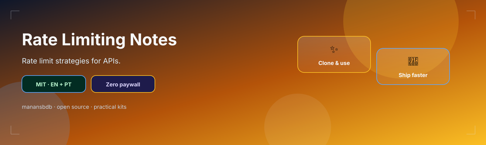
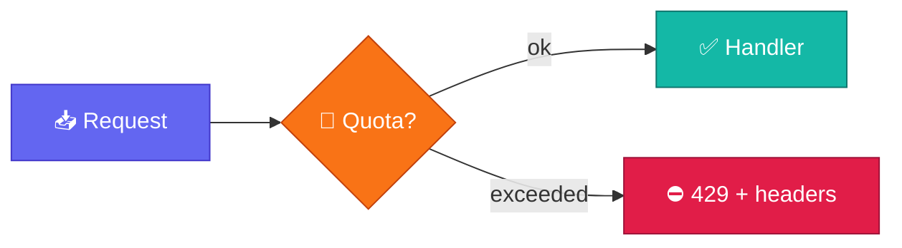

<p align="center">
  
</p>

<h1 align="center">rate-limiting-notes</h1>

<p align="center">
  <strong>EN</strong> API rate-limiting strategies & response headers<br/>
  <strong>PT</strong> Estratégias de rate limiting para APIs e headers de resposta
</p>

<p align="center">
  <a href="https://github.com/manansbdb/rate-limiting-notes/blob/main/LICENSE"></a>
  
  
  <a href="#support--apoio"></a>
</p>

---

## What it does / Para que serve

| English | Português |
|---------|-----------|
| Notes on **rate-limiting strategies** (fixed window, sliding, token bucket) and useful response headers. | Notas sobre **estratégias de rate limiting** (janela fixa, sliding, token bucket) e headers úteis. |
| Use when designing public API quotas and 429 responses. | Usa ao desenhar quotas de API pública e respostas 429. |



---

## Install / Instalação

### 1) Clone / Clona

```bash
git clone https://github.com/manansbdb/rate-limiting-notes.git
cd rate-limiting-notes
```

### 2) Copy into docs / Copia para docs

```bash
mkdir -p docs/api
cp strategies.md docs/api/rate-limiting-strategies.md
cp headers.md docs/api/rate-limiting-headers.md
```

### Requirements / Requisitos

- `git`
- Optional: Redis or in-memory store for implementing limits

---

## Quick start / Início rápido

```bash
git clone https://github.com/manansbdb/rate-limiting-notes.git
# read strategies.md → pick algorithm → document headers from headers.md
```

---

## Contents / Conteúdos

| Path | Purpose / Função |
|------|------------------|
| `strategies.md` | Limiting algorithms |
| `headers.md` | `X-RateLimit-*` / `Retry-After` |
| `SUPPORT.md` | Donations / Doações |

---

## Project layout / Estrutura

```text
rate-limiting-notes/
├── docs/banner.svg
├── strategies.md
├── headers.md
├── SUPPORT.md
└── README.md
```

---

## Support / Apoio

Bitcoin donations welcome / Doações em Bitcoin bem-vindas:

```
bc1q0qfnlnxyum9u45stzxe0a7jnhtj4j0usfkqdjw
```

See [SUPPORT.md](./SUPPORT.md).

---

## License / Licença

[MIT](./LICENSE) © 2026 manansbdb
